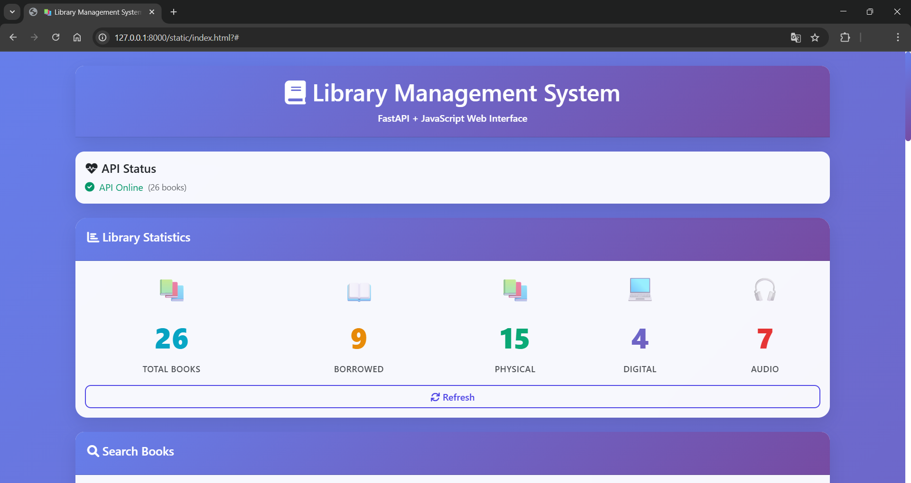
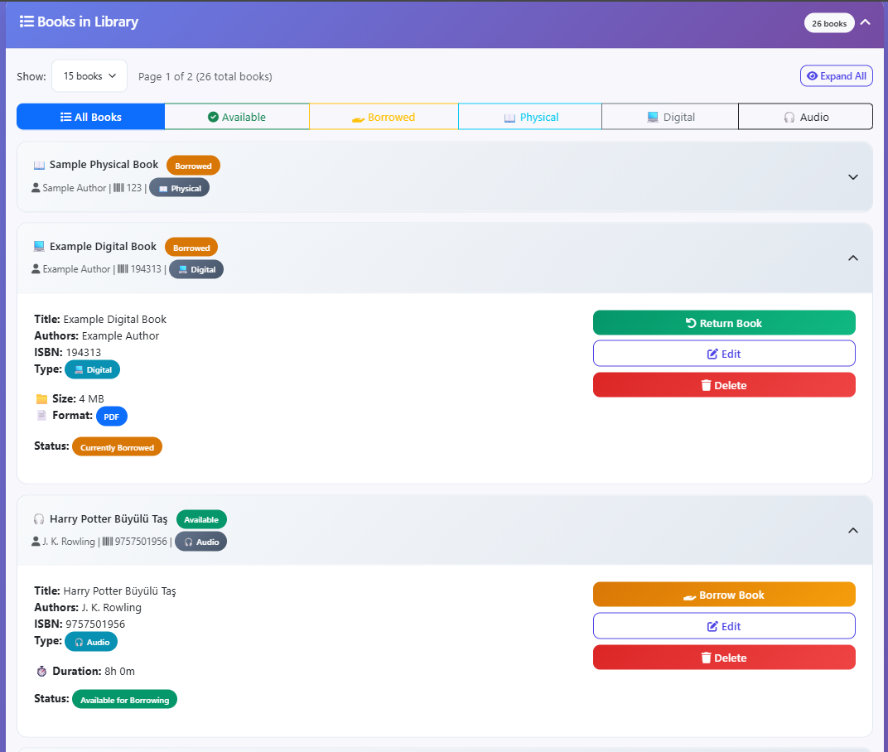
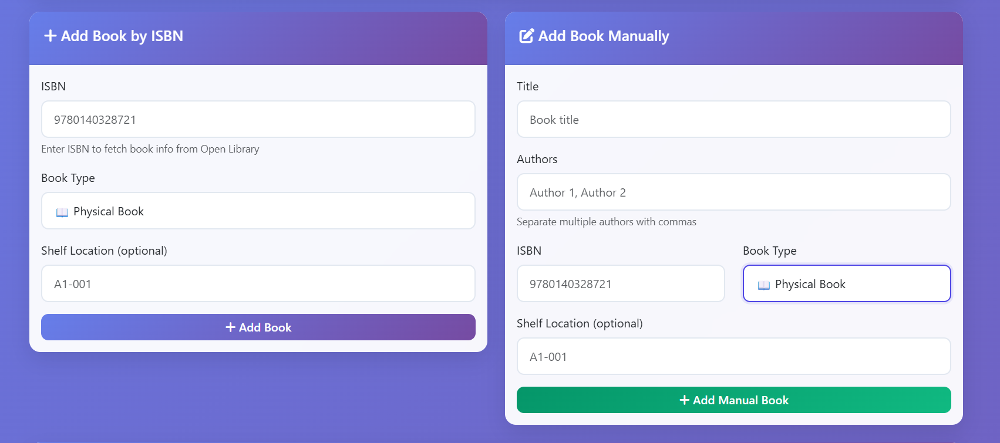
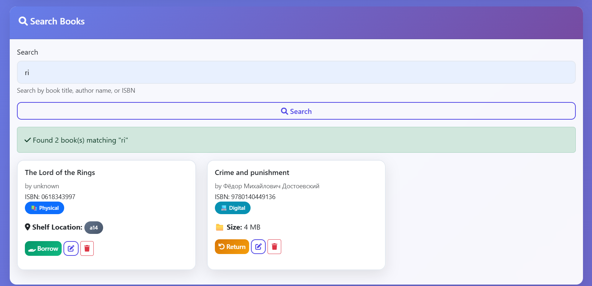
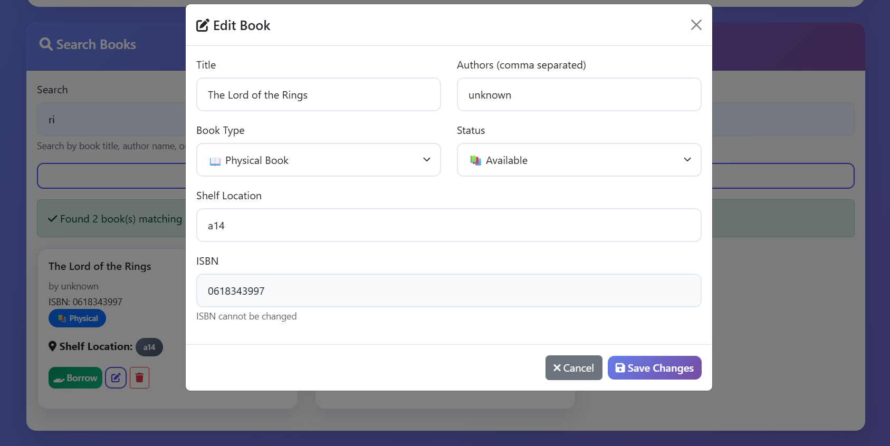
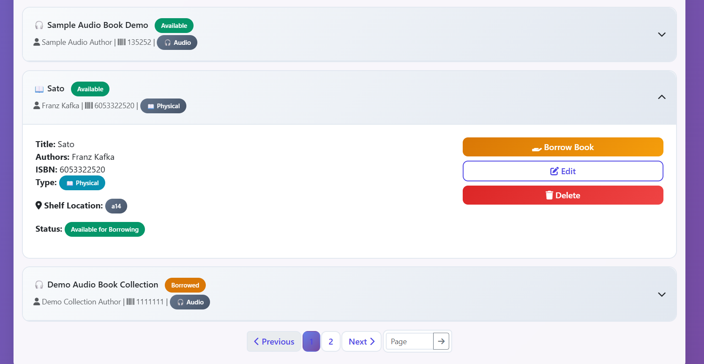
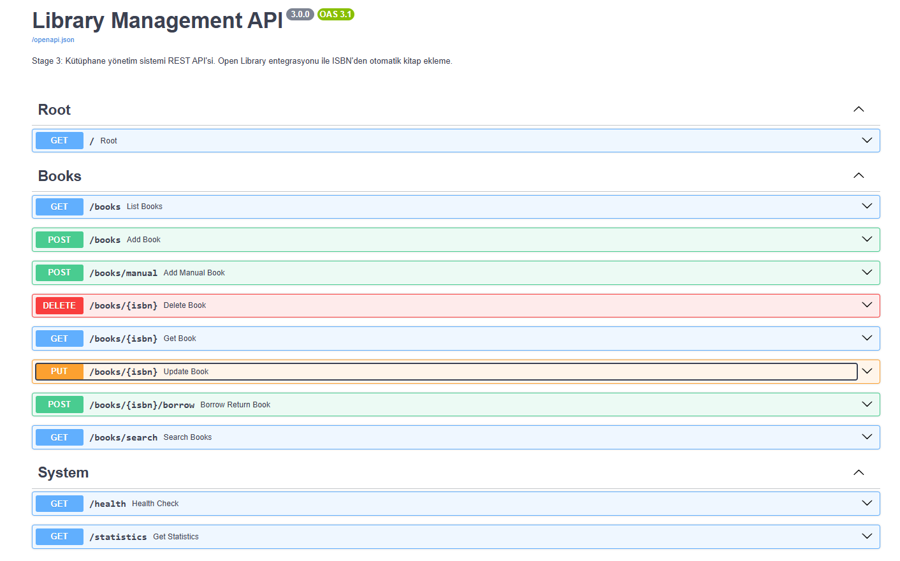

# 📚 Library Management System - Kütüphane Yönetim Sistemi

Bu proje, **Global AI Hub Python 202 Bootcamp** kapsamında geliştirilmiş 3 aşamalı bir kütüphane yönetim sistemidir. Temel OOP yapısından başlayarak REST API'ye kadar ilerleyen modüler bir mimariye sahiptir.

## 🎯 Proje Açıklaması

Bu kütüphane yönetim sistemi şu özelliklere sahiptir:

- **Stage 1**: Temel OOP yapısı, JSON kalıcılık, birim testleri
- **Stage 2**: Open Library API entegrasyonu, ISBN ile otomatik kitap ekleme
- **Stage 3**: FastAPI REST API, Swagger dokümantasyonu, interaktif API arayüzü

Her stage kendi başına bir Python **package** olarak yapılandırılmıştır.

**Teknolojiler**: Python 3.13, FastAPI, Pydantic, httpx, pytest, Open Library API

## 🚀 Kurulum

### 1. Repoyu Klonlayın

```bash
git clone https://github.com/ufukzkn/python_library_app.git
cd python_library_app
```

### 2. Virtual Environment Oluşturun (Windows)

```powershell
python -m venv .venv
.\.venv\Scripts\Activate.ps1
```

### 3. Bağımlılıkları Kurun

```bash
uv pip install -r requirements.txt
```

**Not**: PowerShell execution policy hatası alırsanız:

```powershell
Set-ExecutionPolicy -Scope CurrentUser -ExecutionPolicy RemoteSigned
```

## 💻 Kullanım

**ÖNEMLİ NOT:**  
> Bu projede tüm stage'ler birer Python package olarak yapılandırılmıştır.  
> **Kök dizinde** main.py'leri çalıştırmak için -m eki aşağıdaki gibi kullanılmalıdır.

### Stage 1 & 2: Terminal Uygulaması

**CLI menüsü ile interaktif kullanım:**

```bash
# Stage 1 (Temel kütüphane)
python -m stage1_oop.main

# Stage 2 (API entegrasyonu ile)
python -m stage2_api.main

# Stage 3 (En güncel CLI)
python -m stage3_fastapi.main
```

**CLI Özellikleri:**

- Manuel kitap ekleme (Stage 1 tarzı)
- ISBN ile otomatik kitap ekleme (Stage 2 tarzı - Open Library API)
- Kitap arama, listeleme ve silme
- JSON kalıcılık

### Stage 3: API Sunucusu

**FastAPI REST API başlatma:**

```bash
# API sunucusunu başlatın
uvicorn stage3_fastapi.api:app --reload 
```

**API erişim adresleri:**

- **API Ana Sayfa**: <http://127.0.0.1:8000/>
- **Web Arayüzü**: <http://127.0.0.1:8000/static/index.html>
- **Swagger UI (İnteraktif Dokümantasyon)**: <http://127.0.0.1:8000/docs>
- **ReDoc**: <http://127.0.0.1:8000/redoc>
- **Health Check**: <http://127.0.0.1:8000/health>

## 📸 Arayüz Görüntüleri

### 🌐 Modern Web Arayüzü

#### 📊 API Ana Sayfa & İstatistikler



*Modern Bootstrap 5 tasarımı, API durumu, istatistik kartları ve responsive layout*

#### 📚 Kitap Listesi & Filtreleme



*Kitap tipleri (📖 Physical, 💻 Digital, 🎧 Audio), borrow/return durumu, gelişmiş filtreleme*

#### ➕ Kitap Ekleme (ISBN & Manuel)



*ISBN ile otomatik ekleme (Open Library API) ve manuel ekleme seçenekleri*

#### 🔍 Gelişmiş Arama & Modal Edit




*Canlı arama, tip filtresi, modal edit penceresi, tip değiştirme*

#### 📄 Gelişmiş Sayfalama



*Sayfa numarası seçimi, sayfa boyutu ayarı, gelişmiş navigasyon*

#### 📋 Swagger API Dokümantasyonu



*İnteraktif API dokümantasyonu, endpoint testleri, model şemaları*

### 📱 Responsive Tasarım

Arayüz mobil, tablet ve desktop cihazlarda mükemmel çalışır.

## 📖 API Dokümantasyonu (Güncel)

Stage 3 API şu an JSON tabanlı kalıcılık kullanır ve kitap tiplerine (Physical / Digital / Audio) göre genişletilmiş alanları destekler.

### 🔗 Endpoint Listesi

| Method | Endpoint | Açıklama | Body / Query | Notlar |
|--------|----------|----------|--------------|--------|
| GET | `/` | API root & metadata | - | Versiyon, özellikler, frontend linki |
| GET | `/health` | Sağlık durumu & kitap sayısı | - | `status: healthy` döner |
| GET | `/statistics` | Toplam & tip bazlı istatistikler | - | borrowed / available / type counts |
| GET | `/books` | Tüm kitapları listele | - | Dizi döner |
| GET | `/books/{isbn}` | Tek kitap getir | - | 404 yoksa |
| GET | `/books/search` | Arama & filtre | `?query=...&book_type=...` | `book_type` opsiyonel |
| POST | `/books` | ISBN ile Open Library'den ekle | `{isbn, book_type?, ...tip alanları}` | Var olan ISBN 400 |
| POST | `/books/manual` | Manuel kitap ekle | `{isbn,title,authors[],book_type,...}` | Authors en az 1 |
| PUT | `/books/{isbn}` | Kısmi/güncelle | JSON body | Sadece gelen alanlar değişir |
| DELETE | `/books/{isbn}` | Kitap sil | - | 204 No Content |
| POST | `/books/{isbn}/borrow` | Ödünç / iade | `{"action": "borrow"}` veya `{"action": "return"}` | Yanlış state -> 400 |

### 🧾 Örnek İstekler

ISBN ile (otomatik) ekleme (Physical varsayılan):

```bash
curl -X POST http://127.0.0.1:8000/books \
  -H "Content-Type: application/json" \
  -d '{"isbn":"9780140328721","book_type":"Physical","shelf_location":"A-12"}'
```

Manuel Digital kitap ekleme:

```bash
curl -X POST http://127.0.0.1:8000/books/manual \
  -H "Content-Type: application/json" \
  -d '{"isbn":"1112223334445","title":"Async Python","authors":["Jane Dev"],"book_type":"Digital","file_size_mb":5.2,"file_format":"PDF"}'
```

Arama (tip filtresiyle):

```bash
curl "http://127.0.0.1:8000/books/search?query=python&book_type=Digital"
```

Ödünç alma:

```bash
curl -X POST http://127.0.0.1:8000/books/9780140328721/borrow \
  -H "Content-Type: application/json" \
  -d '{"action":"borrow"}'
```

İade:

```bash
curl -X POST http://127.0.0.1:8000/books/9780140328721/borrow \
  -H "Content-Type: application/json" \
  -d '{"action":"return"}'
```

Güncelleme (tip değiştir & alan ekle):

```bash
curl -X PUT http://127.0.0.1:8000/books/1112223334445 \
  -H "Content-Type: application/json" \
  -d '{"book_type":"Audio","duration_minutes":480,"narrator":"Voice Pro"}'
```

İstatistikler:

```bash
curl http://127.0.0.1:8000/statistics
```

Örnek /statistics cevabı:

```json
{
  "total_books": 12,
  "available_books": 10,
  "borrowed_books": 2,
  "physical_books": 5,
  "digital_books": 4,
  "audio_books": 3
}
```

### 🧩 Model Alanları (Tip Bazlı)

Ortak alanlar: `isbn`, `title`, `authors[]`, `is_borrowed`, `book_type`

Tip özel alanlar:

- Physical: `shelf_location`
- Digital: `file_size_mb`, `file_format`
- Audio: `duration_minutes`, `narrator`

### ⚠️ Hata Kodları

- 400: Geçersiz ISBN, duplicate, yanlış action, invalid state (zaten ödünçte / zaten iade)
- 404: Kitap bulunamadı
- 500: Beklenmeyen sunucu hatası
- 503: Health check hata durumu

### 🔍 Notlar

- `POST /books` Open Library'den veri çeker; yazar listesi boş gelirse minimal fallback olabilir.
- `PUT /books/{isbn}` kısmi güncelleme yapar (PATCH davranışı gibi çalışır).
- `POST /books/{isbn}/borrow` içinde `action` alanı hem ödünç hem iade için tek endpoint sağlar.
- `GET /books/search` author listesinde parça eşleşme yapar (case-insensitive).

## 🧪 Test Senaryoları

## 🔄 Aşamaların Kısa Özeti ve Örnek Çıktılar

### Stage 1: Konsol Tabanlı OOP Uygulaması

Kitap ekleme, silme, arama ve listeleme. JSON dosyasında veri saklama.

**Örnek Çıktı:**

```shell
[1] Add
[2] Remove
[3] List
[4] Find by ISBN
[0] Exit
Choose: 1
Title: Sapiens
Author: Yuval Noah Harari
ISBN: 9780062316097
Added.

[1] Add
[2] Remove
[3] List
[4] Find by ISBN
[0] Exit
Choose: 3
 1. Sapiens by Yuval Noah Harari (ISBN: 9780062316097)
```

### Stage 2: Open Library API ile ISBN’den Kitap Ekleme

Manuel ve otomatik ekleme birlikte kullanılabiliyor.

**Örnek Çıktı:**

```shell
[1] Add book manually (Stage 1 style)
[2] Add book by ISBN from API (Stage 2 style)
[3] Remove
[4] List
[5] Find by ISBN
[0] Exit
Choose: 2
ISBN: 9780140449136
Book successfully added: The Odyssey by Homer (ISBN: 9780140449136)

Choose: 4
 1. The Odyssey by Homer (ISBN: 9780140449136)
```

### Stage 3: FastAPI ile REST API

Swagger/OpenAPI arayüzü, HTTP endpoint’leri, otomatik testler, gelişmiş arama, kitap tipleri (Physical / Digital / Audio), modal edit, pagination ve istatistikler.

**Güncel Root Örneği:**

```http
GET /
200 OK
{
  "message": "Library Management API - Stage 3",
  "version": "3.0.0",
  "features": [
    "Open Library Integration",
    "ISBN-based book addition",
    "Full CRUD operations",
    "Web Frontend"
  ],
  "docs": "/docs",
  "redoc": "/redoc",
  "frontend": "/static/index.html"
}
```

**Güncel Health Örneği (Alanlar kitap sayısına göre değişir):**

```http
GET /health
200 OK
{
  "status": "healthy",
  "api_version": "3.0.0",
  "total_books": 26,
  "features": {
    "open_library_integration": true,
    "isbn_support": true,
    "json_persistence": true
  }
}
```

**Örnek Test Runner Çıktısı (test_stage3.py / test_enhanced.py):**

```shell
=== Stage 3 FastAPI Files Check ===
✓ api.py found
✓ models.py found
✓ library.py found

=== Import Test ===
✓ Models imported successfully
✓ Library imported successfully
✓ FastAPI imported successfully
✓ API app imported successfully
✓ App type: <class 'fastapi.applications.FastAPI'>
✓ App title: Library API

=== FastAPI Manual Test ===
✓ Root endpoint response: 200
✓ Root contains version and features
✓ Health endpoint response: 200
✓ Health contains status=healthy
```

### Test Çalıştırma

```bash
# Tüm testleri çalıştır
pytest -v

# Stage bazında (sayılar yeni feature'lara göre değişebilir)
pytest stage1_oop/tests/ -v
pytest stage2_api/tests/ -v
pytest stage3_fastapi/tests/ -v

# Ek manuel doğrulama runner'ları
python -m stage3_fastapi.test_stage3
python -m stage3_fastapi.test_enhanced
```

### Stage 3 FastAPI Dosya ve Import Testi

Stage 3 FastAPI package'ının dosya yapısı ve importlarının doğru olup olmadığını test etmek için aşağıdaki komutu kullanabilirsiniz:

```powershell
python -m stage3_fastapi.test_stage3
```

**Tipik Çıktı (Özet):**

```shell
=== Stage 3 FastAPI Files Check ===
✓ api.py found
✓ models.py found
✓ library.py found

=== Import Test ===
✓ Models imported successfully
✓ Library imported successfully
✓ FastAPI imported successfully
✓ API app imported successfully
✓ App type: <class 'fastapi.applications.FastAPI'>
✓ App title: Library API

=== FastAPI Manual Test ===
✓ Root endpoint ✓
✓ Health endpoint ✓ (healthy)
```

### Test Kapsamı

**Stage 1 Testleri:**

- ✅ Book sınıfı: `__str__` formatı, ödünç alma/iade
- ✅ Library sınıfı: CRUD operasyonları, JSON kalıcılık
- ✅ Exception handling: Double borrow/return

**Stage 2 Testleri:**

- ✅ API entegrasyonu: Open Library'den kitap çekme
- ✅ Error handling: 404, network errors, malformed JSON
- ✅ Stage 1 compatibility: Mevcut özellikler korundu
- ✅ Mixed operations: Manuel + API ile ekleme

**Stage 3 Testleri:**

- ✅ FastAPI endpoints: Tüm CRUD operasyonları
- ✅ HTTP status codes: 200, 201, 204, 400, 404
- ✅ Request/Response validation: Pydantic modelleri
- ✅ Error scenarios: Invalid ISBN, duplicates, network errors
- ✅ API workflow: End-to-end senaryolar

### Demo Scriptleri

**Stage 2 Demo:**

```bash
python -m stage2_api.stage2_demo
```

- Stage 1 ve Stage 2 özelliklerini test eder
- `stage1_demo.json` ve `stage2_demo.json` dosyaları oluşturur

**Stage 3 Demo:**

```bash
# Önce API'yi başlatın, yani 

uvicorn stage3_fastapi.api:app --reload 

# sonra:
python -m stage3_fastapi.stage3_demo
```

- Tüm API endpoint'lerini test eder
- HTTP isteklerini simüle eder

## 📁 Proje Yapısı

```text
python_oop_kutuphane/
├── stage1_oop/                  # Stage 1: Temel OOP
│   ├── models.py               # Book veri sınıfı
│   ├── library.py              # Library yönetimi + JSON
│   ├── main.py                 # CLI arayüzü
│   └── tests/                  # Birim testleri
├── stage2_api/                 # Stage 2: API Entegrasyonu  
│   ├── models.py               # Geliştirilmiş Book modeli
│   ├── library.py              # Open Library API entegrasyonu
│   ├── main.py                 # Gelişmiş CLI
│   ├── stage2_demo.py          # Demo script
│   └── tests/                  # API testleri
├── stage3_fastapi/             # Stage 3: FastAPI Web API
│   ├── models.py               # Pydantic modelleri
│   ├── library.py              # Library sınıfı (Stage 2'den)
│   ├── api.py                  # FastAPI uygulaması ⭐
│   ├── main.py                 # CLI (Stage 2'den)
│   ├── stage3_demo.py          # API demo
│   ├── test_stage3.py          # FastAPI test runner
│   └── tests/                  # FastAPI testleri
├── requirements.txt            # Bağımlılıklar
├── pytest.ini                 # Test konfigürasyonu
└── README.md                   # Bu dosya
```

## 🔧 Teknik Detaylar

### Veri Modeli

```python
# Book sınıfı (Stage 1-2)
@dataclass
class Book:
    isbn: str
    title: str  
    authors: List[str]
    is_borrowed: bool = False

# Pydantic modeli (Stage 3)
class BookResponse(BaseModel):
    isbn: str
    title: str
    authors: List[str]
    is_borrowed: bool = False
```

### API Entegrasyonu

- **Open Library API**: <https://openlibrary.org/isbn/{isbn}.json>
- **HTTP Client**: httpx (async support)
- **Error Handling**: Network errors, 404, timeout, malformed JSON
- **Fallback Strategy**: API hataları durumunda graceful degradation

### Özellikler

- ✅ **Stage 1 Compatibility**: Tüm aşamalar geriye uyumlu
- ✅ **Unified Data Storage**: CLI ve API aynı JSON dosyasını kullanır
- ✅ **Comprehensive Testing**: Modüler test yapısı
- ✅ **Modern Python**: Type hints, async/await, Pydantic
- ✅ **Production Ready**: Logging, error handling, validation
- 🔄 **Future Ready**: SQLite ve Docker için stage3_plus hazır

## 🎓 Öğrenilen Teknolojiler

- **OOP**: Sınıflar, inheritance, encapsulation
- **API Integration**: REST API'ler, HTTP clients, error handling  
- **Web Development**: FastAPI, async programming, OpenAPI
- **Testing**: pytest, fixtures, mocking, test-driven development
- **Data Validation**: Pydantic modelleri, type checking
- **Documentation**: Swagger/OpenAPI, kod dokümantasyonu
- **Frontend Development**: HTML/CSS/JavaScript, API consumption
- **Containerization**: Docker (stage3_plus'ta planlanıyor)
- **Database**: SQLite (stage3_plus'ta planlanıyor)
- **Infrastructure**: Production deployment patterns

## 🐳 Docker Durumu ve SQLite Planı

### 📋 Mevcut Durum (Stage 3 - JSON Tabanlı)

**Stage 3 FastAPI** şu anda **JSON dosya tabanlı** bir kütüphane yönetim sistemi olarak çalışmaktadır:

- ✅ **FastAPI**: REST API tamamen fonksiyonel
- ✅ **JSON Kalıcılık**: `library.json` dosyasında veri saklama
- ✅ **Web Arayüzü**: Bootstrap 5 ile modern frontend
- ✅ **Test Edilmiş**: Comprehensive testler çalışıyor
- ❌ **Docker**: Henüz implement edilmemiş
- ❌ **SQLite**: Henüz implement edilmemiş

### 🚀 Gelecek Planları (Stage 3+ / Stage 3 Plus)

**Stage 3 Plus** klasöründe geliştirilecek özellikler:

1. **🗄️ SQLite Veritabanı**
   - JSON'dan SQLite'a geçiş
   - Database schema migration
   - ORM entegrasyonu (SQLAlchemy)

2. **🐳 Docker Implementation**
   - Multi-stage Dockerfile
   - Docker Compose orchestration
   - Volume mounting for database
   - Production-ready configuration

3. **🔧 Infrastructure**
   - Health checks
   - Logging configuration
   - Environment variables
   - Database connection pooling

### 📁 Proje Dizin Yapısı

```text
stage3_fastapi/        # Mevcut JSON tabanlı sistem
├── api.py            # FastAPI uygulaması
├── models.py         # Pydantic modelleri
├── library.py        # JSON tabanlı kütüphane
├── library.json      # Veri dosyası
└── static/           # Web arayüzü

stage3_plus/          # Gelecekteki SQLite + Docker
├── [ileride SQLite ve Docker entegrasyonu]
└── [gelişmiş özellikler buraya eklenecek]
```

### 💡 Mevcut Kullanım

Stage 3 sistemini kullanmak için:

```bash
# API'yi başlat
uvicorn stage3_fastapi.api:app --reload

# Web arayüzü: http://127.0.0.1:8000/static/index.html
# API docs: http://127.0.0.1:8000/docs
```

## 🚀 İleri Seviye Özellikler

### ✅ Stage 3'te Tamamlanan Modern Özellikler

- Çoklu kitap tipleri (Physical / Digital / Audio) + tip değiştirme
- Modal edit + kısmi güncelleme (PUT patch-benzeri)
- Gelişmiş arama + tip filtresi + pagination
- Tip bazlı istatistik kartları /statistics endpoint
- Borrow / Return tek endpoint (action=borrow|return)
- Responsive, modern Bootstrap 5 UI + canlı liste yenileme
- JSON kalıcı katman + Pydantic validation
- CLI & API aynı veri kaynağını paylaşır

### 🚧 Stage 3+ (Planlanan - Henüz Uygulanmadı)

- SQLite veritabanı (migration + schema)
- Docker & docker-compose production yapılandırması

### 🗂️ Stage3_plus Dizin Durumu

Şu an iskelet halinde; veritabanı ve container entegrasyonu burada geliştirilecek.

---

**Proje**: Global AI Hub Python 202 Bootcamp Final Project  
**Geliştirici**: [ufukzkn](https://github.com/ufukzkn)  
**Teknolojiler**: Python 3.13 • FastAPI • pytest • Open Library API

---
